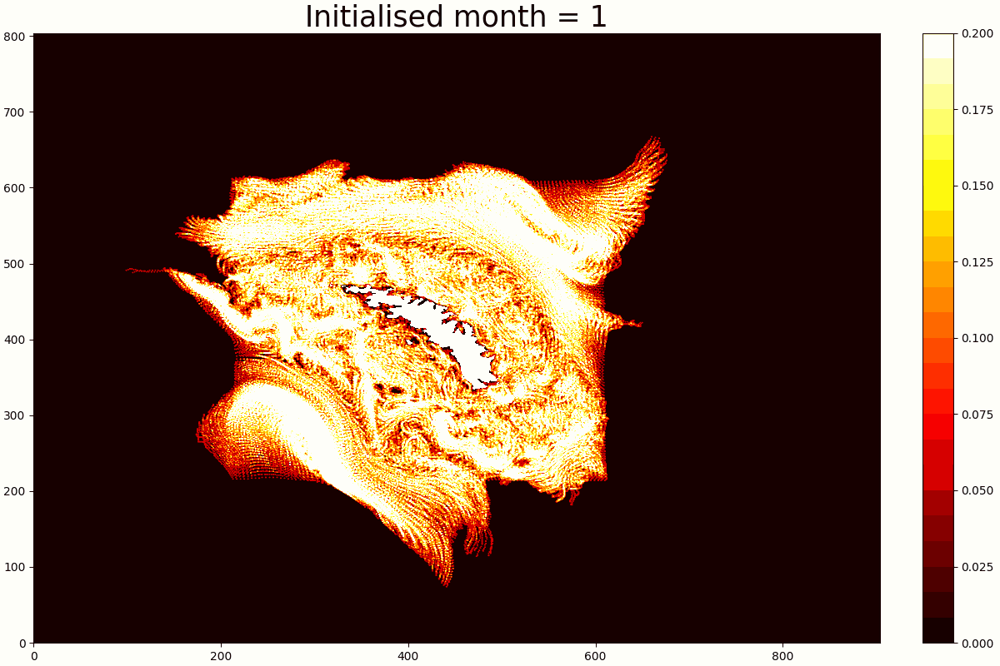

# SG800
Decription:SINMOD 800m resolution South Georgia regional ocean model data coupled to an Antarctic krill IBM



## Installation
Clone repository:
```
git clone git@github.com:ciank94/sg800_krill.git
```
Load Anaconda module (package manager):
```shell
ml load Anaconda3/2022.10
```
Create virtual environment:
```shell
conda env create -f environment.yml --prefix ./pkg_dir
```
The environment `environment.yml` file:
```yml
name: sg800
channels:
  - conda-forge
dependencies:
  - pyproj
  - numpy
  - matplotlib
  - netcdf4
  - time
  - pyyaml
```
To install additional packages:
```shell
conda install --name sg800 [package_name]
```
To activate environment:
```shell
conda activate sg800
```