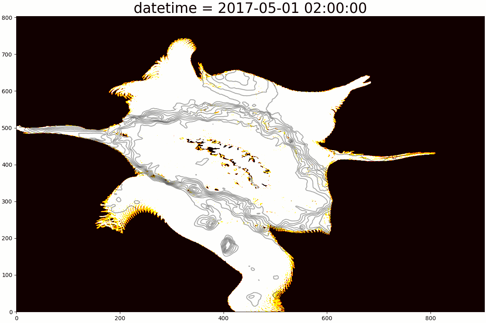

# SG800
Antarctic krill IBM coupled to SINMOD 800 x 800m resolution South Georgia regional ocean model. 



## Installation
Clone repository:
```
git clone git@github.com:ciank94/sg800_krill.git
```
Load Anaconda module (package manager):
```shell
ml load Anaconda3/2022.10
```
Create virtual environment:
```shell
conda env create -f environment.yml --prefix ./pkg_dir
```
The environment `environment.yml` file:
```yml
name: sg800
channels:
  - conda-forge
dependencies:
  - pyproj
  - numpy
  - matplotlib
  - netcdf4
  - time
  - pyyaml
```
To install additional packages:
```shell
conda install --name sg800 [package_name]
```
To activate environment:
```shell
conda activate sg800
```

The job script for idun:
```shell
#!/bin/bash
#SBATCH --job-name=sg800    # Job name
#SBATCH --account=[account_number]
#SBATCH --nodes=1
#SBATCH --ntasks-per-node=2             # Run a single task
#SBATCH --mem-per-cpu=8gb                     # Job memory request
#SBATCH --time=140:00:00               # Time limit hrs:min:sec
#SBATCH --output=output_%j.log   # Standard output and error log


# Set up job environment
set -o errexit # exit on any error
set -o nounset # treat unset variables as error

# Load Anaconda
module load Anaconda3/2024.02-1

# activate the virtual environment
conda activate sg800

# execute main script
python main.py
```

